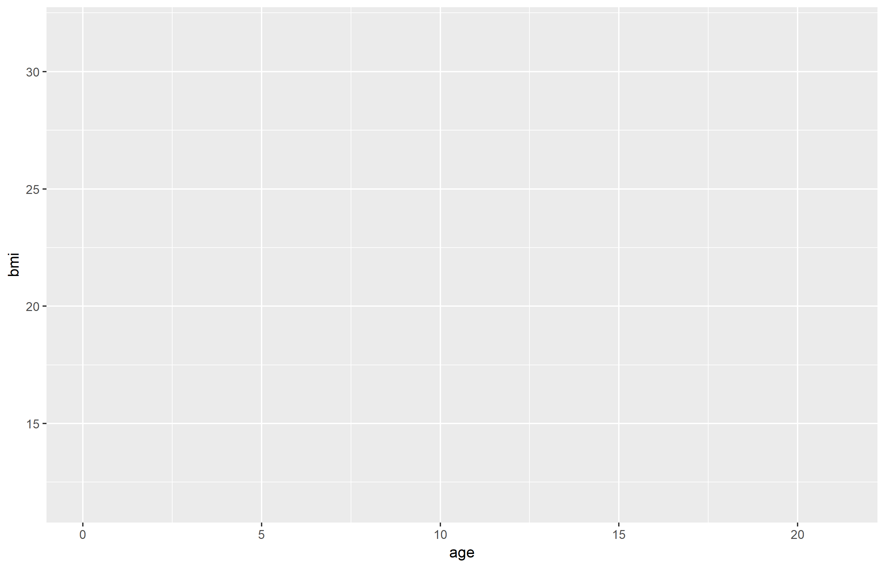

##  We use the following packages
```{r message=FALSE}
library(MASS)     # cats data
library(psych)    # describe function
library(dplyr)    # data manipulation 
library(magrittr) # pipes
library(ggplot2)  # visualization
library(mice)     # boys data
library(haven)    # read SPSS/SAS/STATA data
library(caret)    # crossvalidation
```

# Pipes

## This is a pipe:

```{r message=FALSE, eval = FALSE}
boys <- 
  read_sav("boys.sav") %>%
  head()
```

It effectively replaces `head(read_sav("boys.sav"))`.

</img>

## Why are pipes useful?
Let's assume that we want to load data, change a variable, filter cases and select columns. Without a pipe, this would look like
```{r eval = FALSE}
boys  <- read_sav("boys.sav")
boys2 <- transform(boys, hgt = hgt / 100)
boys3 <- filter(boys2, age > 15)
boys4 <- subset(boys3, select = c(hgt, wgt, bmi))
```

With the pipe:
```{r eval = FALSE}
boys <-
  read_sav("boys.sav") %>%
  transform(hgt = hgt/100) %>%
  filter(age > 15) %>%
  subset(select = c(hgt, wgt, bmi))
```

Benefit: a single object in memory that is easy to interpret


## With pipes
Your code becomes more readable:

- data operations are structured from left-to-right and not from in-to-out
- nested function calls are avoided
- local variables and copied objects are avoided
- easy to add steps in the sequence

## What do pipes do:

- `f(x)` becomes `x %>% f()`
```{r}
rnorm(10) %>% mean()
```
- `f(x, y)` becomes `x %>% f(y)` 
```{r}
boys[, 1:5] %>% cor(use = "pairwise.complete.obs")
```
- `h(g(f(x)))` becomes `x %>% f %>% g %>% h` 
```{r}
boys %>% subset(select = wgt) %>% na.omit() %>% max()
```

# More pipe stuff

## The standard `%>%` pipe
<center>

</center>
<br>

```{r}
boys %>% psych::describe(skew = FALSE)
```

## The `%$%` pipe
<center>

</center>
<br>
```{r}
boys %$% mean(age)
```

## The role of `.` in a pipe
In `a %>% b(arg1, arg2, arg3)`, `a` will become `arg1`. With `.` we can change this.
```{r error=TRUE}
cats %>%
  plot(Hwt ~ Bwt, data = .)
```
VS
```{r}
cats %$%
  plot(Hwt ~ Bwt)
```
The `.` can be used as a placeholder in the pipe. 

## Performing a t-test in a pipe
```{r message=FALSE}
cats %$%
  t.test(Hwt ~ Sex)
```
is the same as 
```{r eval=FALSE}
t.test(Hwt ~ Sex, data = cats)
```

## Storing a t-test from a pipe
```{r}
cats.test <- cats %$%
  t.test(Bwt ~ Sex)

cats.test
```

# Data visualization with `ggplot2`

## The `anscombe` data
```{r}
anscombe
```

##  Fitting a line {.smaller}
```{r eval = FALSE, message = FALSE}
anscombe %>%
  ggplot(aes(y1, x1)) + 
  geom_point() + 
  geom_smooth(method = "lm")
```

##  Fitting a line {.smaller}

```{r echo=FALSE, message = FALSE}
anscombe %>%
  ggplot(aes(y1, x1)) + 
  geom_point() + 
  geom_smooth(method = "lm")
```

## Why visualise?

- We can process a lot of information quickly with our eyes
- Plots give us information about
    - Distribution / shape
    - Irregularities
    - Assumptions
    - Intuitions
- Summary statistics, correlations, parameters, model tests, *p*-values do not tell the whole story

### ALWAYS plot your data!


## Why visualise?

</img>
<p style="text-align:center;font-style:italic;font-size:0.5em;">Source: Anscombe, F. J. (1973). "Graphs in Statistical Analysis". American Statistician. 27 (1): 17–21.</p>


## Why visualise?

</img>

## What is `ggplot2`?
Layered plotting based on the book **The Grammer of Graphics** by Leland Wilkinsons.

With `ggplot2` you

1. provide the _data_
2. define how to map variables to _aesthetics_
3. state which _geometric object_ to display
4. (optional) edit the overall _theme_ of the plot

`ggplot2` then takes care of the details

## An example: scatterplot

1: Provide the data
```{r, eval=FALSE}
mice::boys %>%
  ggplot()
```

2: map variable to aesthetics
```{r, eval=FALSE}
mice::boys %>%
  ggplot(aes(x = age, y = bmi))
```

3: state which geometric object to display
```{r, eval=FALSE}
mice::boys %>%
  ggplot(aes(x = age, y = bmi)) +
  geom_point()
```

## An example: scatterplot
```{r, echo=FALSE, fig.align='center'}
mice::boys %>%
  ggplot(aes(x = age, y = bmi)) +
  geom_point(na.rm = TRUE)
```

## Why this syntax?

Create the plot
```{r, fig.align='center', dev.args=list(bg="transparent"), warning=FALSE, message=FALSE}
gg <- 
  mice::boys %>%
  ggplot(aes(x = age, y = bmi)) +
  geom_point(col = "dark green")
```

Add another layer (smooth fit line)
```{r, warning=FALSE, message=FALSE, fig.align='center', dev.args=list(bg="transparent")}
gg <- gg + 
  geom_smooth(col = "dark blue")
```

Give it some labels and a nice look
```{r, fig.align='center', dev.args=list(bg="transparent")}
gg <- gg + 
  labs(x = "Age", y = "BMI", title = "BMI trend for boys") +
  theme_minimal()
```

## Why this syntax?
```{r, warning=FALSE, message=FALSE, fig.align='center', dev.args=list(bg="transparent")}
plot(gg)
```

## Why this syntax?
</img>

# Linear models

## Notation
The mathematical formulation of the relationship between variables can be written as

\[
\mbox{observed}=\mbox{predicted}+\mbox{error}
\]

or (for the greek people) in notation as
\[y=\mu+\varepsilon\]

where

-  $\mu$ (mean) is the part of the outcome that is explained by model 
-  $\varepsilon$ (residual) is the part of outcome that is not explained by model 


## Univariate expectation
```{r, echo=FALSE}
library(ggplot2)
set.seed(123)
plotdata <- data.frame(X = rnorm(100, 167.5, 10),
           Y = rnorm(100, 180.8, 10)) 
plotdata %>%
  ggplot(aes(X, Y)) + 
  geom_point(color = "blue") + 
  geom_point(aes(mean(X), mean(Y)), color = "orange", size = 5) + 
  geom_vline(xintercept = 168.4041, color = "orange") + 
  geom_hline(yintercept = 179.7245 , color = "orange") + 
  ggtitle(bquote("Bivariate normal")) + 
  theme_minimal()
```

## Conditional expectation
```{r echo=FALSE}
fit <- plotdata %$%
  lm(Y~X)

plotdata %>%
  mutate(predicted = predict(fit),
          residuals = residuals(fit)) %>%
  ggplot(aes(X, Y)) +
  geom_smooth(method = "lm", se = FALSE, color = "orange") +
  geom_segment(aes(xend = X, yend = predicted), color = "orange", alpha = .5) +
  geom_point(aes(color = abs(residuals))) + 
  scale_color_continuous(low = "blue", high = "red") +  
  guides(color = FALSE) +  
  geom_point(aes(y = predicted), shape = 1, color = "orange") +
  ggtitle("Multivariate (X, Y)") + 
  theme_minimal()
```

# Assumptions

## The key assumptions
There are four key assumptions about the use of linear regression models. 

In short, we assume 

- The outcome to have a **linear relation** with the predictors and the predictor relations to be **additive**. 
  - the expected value for the outcome is a straight-line function of each predictor, given that the others are fixed. 
  - the slope of each line does not depend on the values of the other predictors
  - the effects of the predictors on the expected value are additive
  
  $$ y = \alpha + \beta_1X_1 + \beta_2X_2 + \beta_3X_3 + \epsilon$$

- The residuals are statistically **independent**
- The residual **variance is constant**
  - accross the expected values
  - across any of the predictors
- The residuals are **normally distributed** with mean $\mu_\epsilon = 0$

## A simple model
```{r cache = FALSE}
fit <- anscombe %$%
  lm(y1 ~ x1)
fit

fit2 <- anscombe %$%
  lm(y2 ~ x2)
```

## Checking assumptions

1. linearity
    - scatterplot $y$ and $x$ 
    - include loess curve when in doubt
    - does a squared term improve fit?
2. normality residuals
    -  normal probability plots `qqnorm()`
    -  if sample is small; `qqnorm` with simulated errors cf. `rnorm(n, 0, s)` 
3. constant error variance 
    -  residual plot
    -  scale-location plot

## Linearity {.smaller}
```{r eval = FALSE, message = FALSE}
anscombe %>%
  ggplot(aes(x1, y1)) + 
  geom_point() + 
  geom_smooth(method = "loess", col = "blue") + 
  geom_smooth(method = "lm", col = "orange")
```

## Linearity {.smaller}
```{r echo=FALSE, message = FALSE}
anscombe %>%
  ggplot(aes(x1, y1)) + 
  geom_point() + 
  geom_smooth(method = "loess", col = "blue") + 
  geom_smooth(method = "lm", col = "orange")
```

The loess curve suggests slight non-linearity

## Adding a squared term
```{r message=FALSE, warning = FALSE}
anscombe %$%
  lm(y1 ~ x1 + I(x1^2)) %>%
  summary()
```

## Constant error variance? {.smaller}
```{r, fig.height=4, dev.args = list(bg = 'transparent')}
par(mfrow = c(1, 2))
fit %>%
  plot(which = c(1, 3), cex = .6)
```

## No constant error variance! {.smaller}
```{r, fig.height=4, dev.args = list(bg = 'transparent')}
par(mfrow = c(1, 2))
boys %$%
  lm(bmi ~ age) %>%
  plot(which = c(1, 3), cex = .6)
```

## Normality of errors {.smaller}
```{r, fig.height=4, dev.args = list(bg = 'transparent')}
fit %>%
  plot(which = 2, cex = .6)
```

The QQplot shows some divergence from normality at the tails

# Outliers, influence and robust regression

## Outliers and influential cases {.smaller}

Leverage: see the fit line as a lever. 
  
  - some points pull/push harder; they have more leverage
  
Standardized residuals:

  - The values that have more leverage tend to be closer to the line
  - The line is fit so as to be closer to them
  - The residual standard deviation can differ at different points on $X$ - even if the error standard deviation is constant. 
  - Therefore we standardize the residuals so that they have constant variance (assuming homoscedasticity). 

Cook's distance: how far the predicted values would move if your model were fit without the data point in question. 

  - it is a function of the leverage and standardized residual  associated with each data point

```{r echo = FALSE}
set.seed(20)

pred1 = rnorm(20, mean=20, sd=3)
outcome1 = 5 + .5*pred1 + rnorm(20)

pred2 = c(pred1, 30);        outcome2 = c(outcome1, 20.8)
pred3 = c(pred1, 19.44);     outcome3 = c(outcome1, 20.8)
pred4 = c(pred1, 30);        outcome4 = c(outcome1, 10)
```

## Fine
```{r echo=FALSE}
par(mfrow = c(1,2))
plot(outcome1 ~ pred1, ylim = c(9, 25), xlim = c(10, 30))
abline(lm(outcome1 ~ pred1))
plot(lm(outcome1 ~ pred1), which = 5)
```

## High leverage, low residual
```{r echo=FALSE}
par(mfrow = c(1,2))
plot(outcome2 ~ pred2, ylim = c(9, 25), xlim = c(10, 30))
points(30, 20.8, col = "red")
abline(lm(outcome2 ~ pred2))
plot(lm(outcome2 ~ pred2), which = 5)
```

## Low leverage, high residual
```{r echo=FALSE}
par(mfrow = c(1,2))
plot(outcome3 ~ pred3, ylim = c(9, 25), xlim = c(10, 30))
abline(lm(outcome3 ~ pred3))
points(19.44, 20.8, col = "red")
plot(lm(outcome3 ~ pred3), which = 5)
```

## High leverage, high residual
```{r echo=FALSE}
par(mfrow = c(1,2))
plot(outcome4 ~ pred4, ylim = c(9, 25), xlim = c(10, 30))
points(30, 10, col = "red")
abline(lm(outcome4 ~ pred4))
plot(lm(outcome4 ~ pred4), which = 5)
```

## Outliers and influential cases
Outliers are cases with large $e_z$  (standardized residuals).

If the model is ***correct***  we expect:
  
  -  5\% of $|e_z|>1.96$ 
  -  1\% of $|e_z|>2.58$
  -  0\% of $|e_z|>3.3$ 

Influential cases are cases with large influence on parameter estimates
  
  -  cases with Cook's Distance $> 1$, or 
  -  cases with Cook's Distance much larger than the rest

## Outliers and influential cases
```{r, fig.height= 3, dev.args = list(bg = 'transparent')}
par(mfrow = c(1, 2), cex = .6)
fit %>% plot(which = c(4, 5))
```

There are no cases with $|e_z|>2$, so no outliers (right plot). There are no cases with Cook's Distance $>1$, but case 3 stands out 


# Model fit

## A simple model
```{r cache = FALSE}
boys.fit <- 
  na.omit(boys) %$% # Extremely wasteful
  lm(age ~ reg)
boys.fit

boys %>% na.omit(boys) %$% aggregate(age, list(reg), mean)
```

## Plotting the model
```{r fig.height=3.5}
means <- boys %>% na.omit(boys) %>% group_by(reg) %>% summarise(age = mean(age))
ggplot(na.omit(boys), aes(x = reg, y = age)) + 
  geom_point(color = "grey") + 
  geom_point(data = means, stat = "identity", size = 3)
```


## Model parameters
```{r cache = FALSE}
boys.fit %>%
  summary()
```

## Scientific notation
If you have trouble reading scientific notation, `2e-16` means the following

$$2\text{e-16} = 2 \times 10^{-16} = 2 \times (\frac{1}{10})^{-16}$$

This indicates that the comma should be moved 16 places to the left:

$$2\text{e-16} = 0.0000000000000002$$

## AIC
Akaike's *An Information Criterion* 
```{r cache = FALSE}
boys.fit %>% 
  AIC()
```

### What is AIC
AIC comes from information theory and can be used for model selection. The AIC quantifies the information that is lost by the statistical model, through the assumption that the data come from the same model. In other words: AIC measures the fit of the model to the data. 

- The better the fit, the less the loss in information
- AIC works on the log scale:
  - $\text{log}(0) = -\infty$, $\text{log}(1) = 0$, etc. 
- the closer the AIC is to $-\infty$, the better

# Model comparison

## A new model
Let's add predictor `hgt` to the model:
```{r cache = FALSE}
boys.fit2 <- 
  na.omit(boys) %$%
  lm(age ~ reg + hgt)

boys.fit %>% AIC()
boys.fit2 %>% AIC()
```

## Another model
Let's add `wgt` to the model
```{r cache = FALSE}
boys.fit3 <- 
  na.omit(boys) %$%
  lm(age ~ reg + hgt + wgt)
```

## And another model
Let's add `wgt` and the interaction between `wgt` and `hgt` to the model
```{r cache = FALSE}
boys.fit4 <- 
  na.omit(boys) %$%
  lm(age ~ reg + hgt * wgt)
```
is equivalent to 
```{r eval=FALSE}
boys.fit4 <- 
  na.omit(boys) %$%
  lm(age ~ reg + hgt + wgt + hgt:wgt)
```

## Model comparison
```{r cache = FALSE}
AIC(boys.fit, boys.fit2, boys.fit3, boys.fit4)
```

## And with `anova()`
```{r cache = FALSE}
anova(boys.fit, boys.fit2, boys.fit3, boys.fit4)
```

## Inspect `boys.fit3`
```{r cache = FALSE}
boys.fit3 %>% anova()
```

## Inspect `boys.fit4`
```{r cache = FALSE}
boys.fit4 %>% anova()
```
It seems that `reg` and the interaction `hgt:wgt` are redundant

## Remove `reg`
```{r}
boys.fit5 <- 
  na.omit(boys) %$%
  lm(age ~ hgt + wgt)
```
Let's revisit the comparison
```{r}
anova(boys.fit, boys.fit2, boys.fit3, boys.fit5)
```
The `boys.fit5` model is better than the previous model - it has fewer parameters

## Influence of cases
DfBeta calculates the change in coefficients depicted as deviation in SE's.
```{r cache = FALSE}
boys.fit5 %>%
  dfbeta() %>%
  head(n = 7)
```

# Prediction

## Fitted values
Let's use the simpler `anscombe` data example
```{r cache = FALSE}
fit <- anscombe %$% lm(y1 ~ x1)

y_hat <- 
  fit %>%
  fitted.values()
```
The residual is then calculated as
```{r cache = FALSE}
y_hat - anscombe$y1
```

## Predict new values
If we introduce new values for the predictor `x1`, we can generate predicted values from the model
```{r cache = FALSE, warning=FALSE}
new.x1 <- data.frame(x1 = 1:20)
fit %>% predict(newdata = new.x1)
```

## Prediction intervals
```{r warning=FALSE}
fit %>% predict(interval = "prediction")
```

A prediction interval reflects the uncertainty around a single value. The confidence interval 
reflects the uncertainty around the mean prediction values. 

# Assessing predictive accuracy

## K-fold cross-validation

- Divide sample in $k$ mutually exclusive training sets
- Do for all $j\in\{1,\dots,k\}$ training sets
  
    1. fit model to training set $j$
    2. obtain predictions for test set $j$  (remaining cases)
    3. compute residual variance (MSE) for test set $j$
  
- Compare MSE in cross-validation with MSE in sample
- Small difference suggests good predictive accuracy

## The original model
```{r}
fit %>% summary()
```

## K-fold cross-validation `anscombe` data {.smaller}
```{r echo=T, fig.height=3.5, dev.args = list(bg = 'transparent')}
set.seed(123)
train.control <- trainControl(method = "cv", number = 3)
model <- train(y1 ~ x1, data = anscombe, method = "lm",
               trControl = train.control)
model
```

## Another approach
```{r}
library(lmvar)
fit <- anscombe %$% lm(y1 ~ x1, y = TRUE, x = TRUE)
lmvar::cv.lm(fit, k = 3, seed = 123)
```


## K-fold cross-validation `boys` data {.smaller}
```{r echo=T, fig.height=3.5, dev.args = list(bg = 'transparent')}
set.seed(123)
train.control <- trainControl(method = "cv", number = 3)
model <- train(age ~ hgt + wgt, data = na.omit(boys), method = "lm",
               trControl = train.control)
model
```

## Another approach
```{r}
fit <- boys %$% lm(age ~ hgt + wgt, y = TRUE, x = TRUE)
lmvar::cv.lm(fit, k = 3)
```

## How many cases are used?
```{r}
na.omit(boys) %$%
  lm(age ~ hgt + wgt) %>%
  nobs()
```

If we would not have used `na.omit()`
```{r}
boys %$%
  lm(age ~ hgt + wgt) %>%
  nobs()
```

## Some other modeling devices in `R`
- `lm()`: linear modeling
- `glm()`: generalized linear modeling
- `gamlss::gamlss`: generalized additive models (for location, scale and shape)
- `lme4::lmer`: linear mixed effect models
- `lme4::glmer`: generalized linear mixed effect models
- `lme4::nlmer`: non-linear mixed effect models

